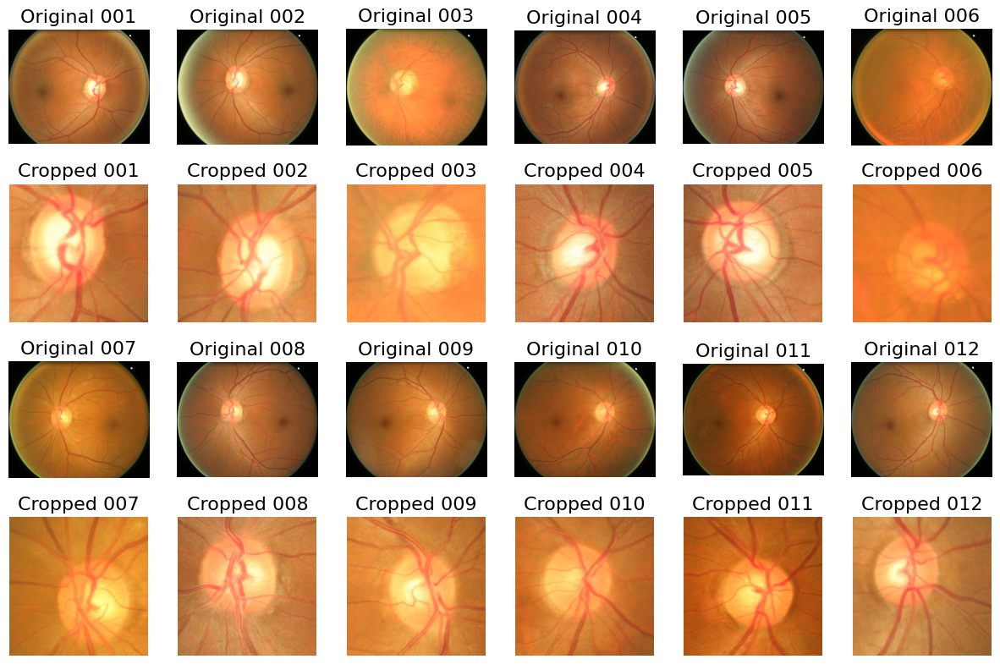
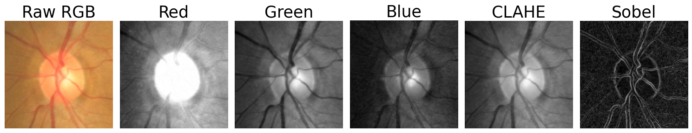
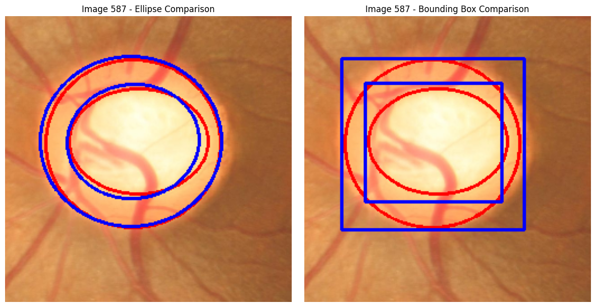
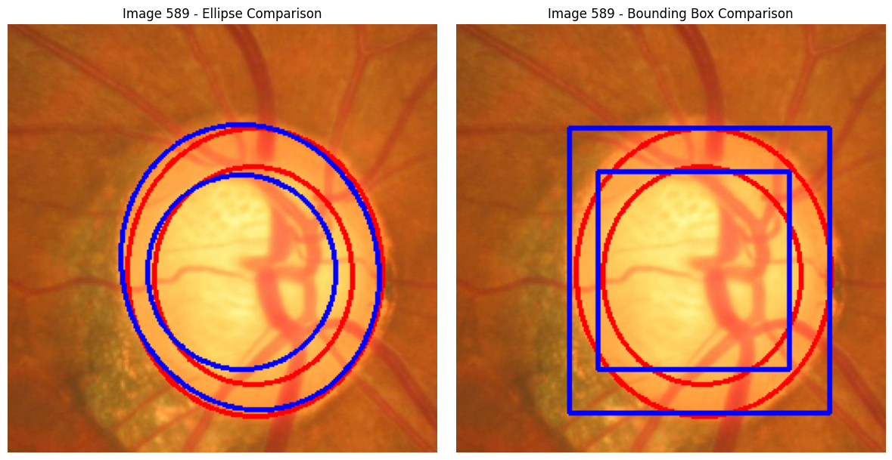

# Glaucoma Fundus Segmentation and Analysis (U-Net) — ORIGA

This repository contains code for a dissertation project on optic disc and optic cup segmentation from retinal fundus images using a U-Net architecture. The resulting segmentations are used to derive geometric features such as the Cup-to-Disc Ratio (CDR), which is commonly used in glaucoma screening.

The work is based on the ORIGA (Online Retinal Fundus Image Database for Glaucoma Analysis) public dataset.

## Overview

The pipeline consists of:

- preprocessing and jittered cropping around the optic nerve head,

- construction of multi-channel input stacks,

- supervised segmentation of optic disc and optic cup,

- post-processing using geometric approximations (ellipse fitting and bounding boxes),

- qualitative and quantitative evaluation of predictions.

The project prioritises clarity, reproducibility, and analysis rather than end-to-end automation.

## Offline Preprocessing and Cropping

Fundus images are cropped offline using a jittered crop centred on the annotated optic disc. This ensures consistent focus on the region of interest while introducing controlled spatial variability.

Example outputs of the cropping algorithm:



## Multi-Channel Input Representation

Each cropped fundus image is converted into a 5-channel input stack:

- RGB fundus image (3 channels)

- CLAHE-enhanced grayscale image (1 channel)

- Sobel edge magnitude image (1 channel)

This representation combines colour, contrast-enhanced structure, and edge information to better capture disc and cup boundaries.

Example preprocessing stack:



## Model and Post-Processing

Separate U-Net models are trained for optic disc and optic cup segmentation. Predicted masks are post-processed using:

- ellipse fitting, and

- axis-aligned bounding boxes.

These geometric representations are used to compute measurements such as vertical diameters and the Cup-to-Disc Ratio (CDR).

Example qualitative inference results:





## Repository Structure
```assets/                # Figures for README and report
data/                  # Local data (not committed)
  ORIGA/               # Raw ORIGA dataset
    images/            # Original fundus images
    masks/             # Original annotation masks (single mask, multiple labels)
  images/              # Jitter-cropped images
  masks/               # Jitter-cropped masks
  stacks/              # Multi-channel input stacks (.npy)

notebooks/             # Training history, notebooks for reviewing
runs/                  # Outputs saved per experiment run
src/                   # Main source code
  preprocess/          # Offline preprocessing utilities
  metrics.py           # Custom losses and metrics
  model.py             # U-Net architecture
  trainer.py           # Training pipeline
```
## Notes

The ORIGA dataset is not included; only sample data are provided.

Training outputs and large files are excluded from version control.

Exploratory analyses (e.g. feature importance) are handled separately from the core pipeline.