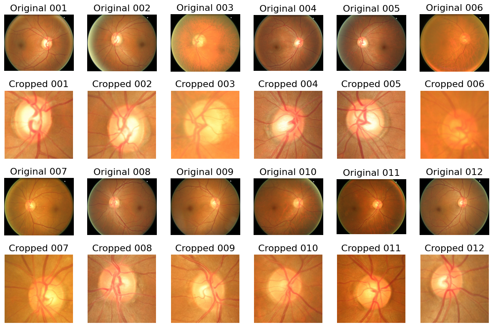
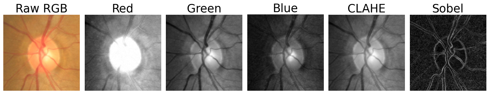
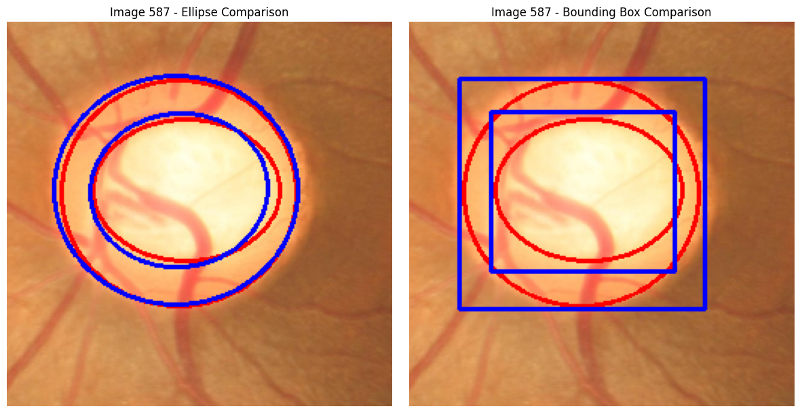
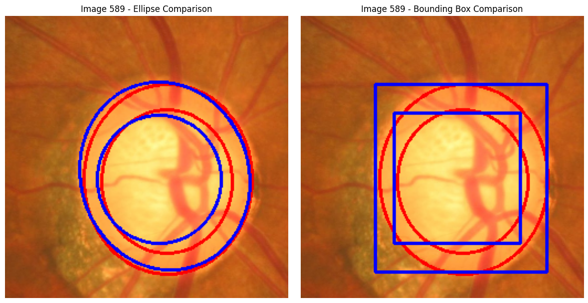

# Glaucoma Fundus Segmentation and Analysis (U-Net) — ORIGA

This project develops a U-Net-based pipeline for optic disc and cup segmentation in retinal fundus images, with applications to automated glaucoma screening. 

Beyond segmentation, it investigates the fundamental limits of diagnostic precision imposed by image resolution, introducing a model-invariant performance bound on Cup-to-Disc Ratio (CDR) estimation.

This repository contains code for my dissertation project on optic disc and optic cup segmentation from retinal fundus images using a U-Net architecture. The resulting segmentations are used to derive geometric features such as the Cup-to-Disc Ratio (CDR), which is commonly used in glaucoma screening.

The work is based on the ORIGA (Online Retinal Fundus Image Database for Glaucoma Analysis) dataset.

## Overview

The pipeline comprises the following stages:

- Preprocessing and jittered cropping centred on the optic nerve head  
- Construction of multi-channel input representations  
- Supervised segmentation of the optic disc and optic cup  
- Post-processing via geometric approximations (e.g., ellipse fitting and bounding boxes)  
- Qualitative and quantitative evaluation of model predictions  

Beyond segmentation, the project investigates the relative and absolute importance of geometric features derived from fundus images for glaucoma classification. This is achieved through univariate analysis of class separability using statistical hypothesis testing and ROC-AUC analysis. The potential for improved discriminative performance through feature combination is further explored using L1-regularised logistic regression and Random Forest models.

## Key Contribution

This project introduces an analytical formulation of the model-invariant error arising from image downsampling. 

This defines a fundamental lower bound on the achievable precision of Cup-to-Disc Ratio (CDR) estimation — establishing a performance ceiling that is independent of segmentation model quality and addressing a gap in the existing literature.

## Pipeline

### Offline Preprocessing and Cropping

Fundus images are cropped offline using a region centred on the annotated optic disc, followed by a small random spatial shift. This ensures consistent focus on the region of interest while introducing controlled variability.

This approach serves as a simple proxy for Region of Interest (ROI) localisation. It is intentionally conservative (existing ROI detection methods can achieve tighter and more stable crops) so this step does not limit the real-world applicability of the pipeline. However, in a deployment setting, it should be replaced with a ground-truth-agnostic ROI detection algorithm.

Example outputs of the cropping algorithm:



### Multi-Channel Input Representation

Each cropped fundus image is converted into a 5-channel input stack:

- RGB fundus image (3 channels)
- CLAHE-enhanced grayscale image (1 channel)
- Sobel edge magnitude image (1 channel)

This representation combines colour, contrast-enhanced structure, and edge information to better capture disc and cup boundaries.

Example preprocessing stack:



### Model and Post-Processing

Separate U-Net models are trained for optic disc and optic cup segmentation. Predicted masks are post-processed using:

- ellipse fitting  
- axis-aligned bounding boxes  

These geometric representations are used to compute measurements such as vertical diameters and the Cup-to-Disc Ratio (CDR). Post training analysis found a negligible difference between ellipse and bounding-box fitting on the CDR error. 

Example qualitative inference results:

  



## Repository Structure
```
assets/                       # Figures for README
analysis/                     
  feature_importance.ipynb    # Notebook containing exploratory analysis of best ocular features for maximum class seperability
  Precision Analysis.pdf      # Report Extract, highlighting novel insight into intrinsic limitations imposed by image resizing
  training_summary.ipynb      # Notebook containing the training history of final cup and disc models utilised in the dissertation
data/                         # Local data (only sample range committed)
  ORIGA/                      # Raw ORIGA dataset 
    images/                   # Original fundus images
    masks/                    # Original annotation masks (single mask, multiple labels)
  images/                     # Cropped images
  masks/                      # Cropped masks
  stacks/                     # Multi-channel input stacks (.npy)
runs/                         # Outputs saved per experiment run (model files not commited)
src/                          # Main source code
  preprocess/                 # Offline preprocessing utilities used to populate the data folder
    jitter_crop_ROI.py        # Emulates rudimentary Region of Interest cropping required before processing
    create_stacks.py          # Prepares stacks for feeding into model architecture from cropped images
  metrics.py                  # Custom losses and metrics
  model.py                    # U-Net architecture
  trainer.py                  # Training pipeline
```

## Notes

The ORIGA dataset is not included; only sample data are provided.  

Full dataset access can be requested from the original publication:  
https://ieeexplore.ieee.org/document/5626137/

Training outputs and large files are excluded from version control.